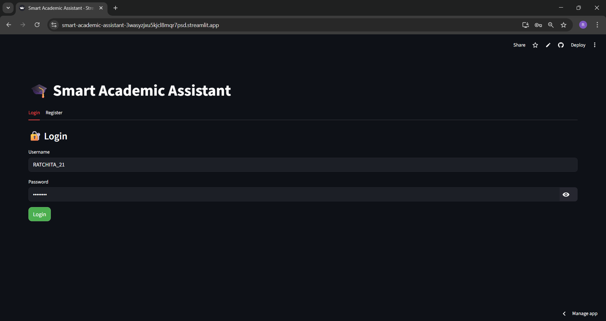
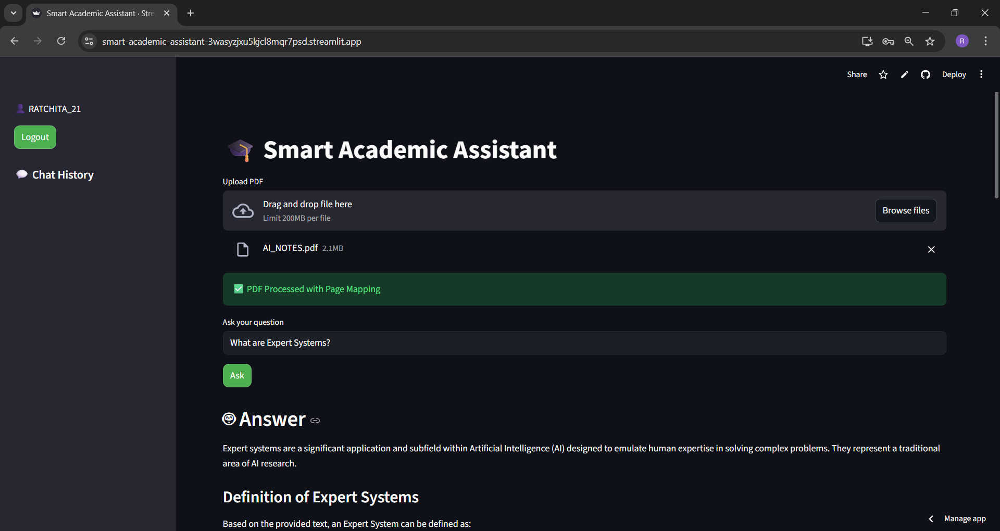

---


---

# 🎓 Smart Academic Assistant
> 🧠 AI-Powered Learning Assistant for Smart Study & Knowledge Retrieval


---

## 🚀 Overview

**Smart Academic Assistant** is an AI-powered platform that helps students understand concepts efficiently using:

- 📄 PDF-based learning  
- 🤖 Generative AI answers (Gemini)  
- 🔍 Semantic search using FAISS  
- 🧠 Structured Mindmaps  
- 📌 Key point extraction  

---

## ✨ Features

- 🔐 **User Authentication (Login/Register)**  
- 📄 **Upload PDF & Ask Questions**  
- 🔍 **Semantic Search with Embeddings**  
- 🤖 **AI Answer Generation (Gemini API)**  
- 🧠 **Automatic Mindmap Generation**  
- 📌 **Key Points Extraction**  
- 💬 **Per-user Chat History**  
- ⚡ **Fast Retrieval using FAISS**  

---

## 🧠 Tech Stack

| Technology | Purpose |
|----------|--------|
| Streamlit | Frontend UI |
| Google Gemini API | Generative AI |
| Sentence Transformers | Embeddings |
| FAISS | Vector Search |
| PyPDF | PDF Processing |
| Python | Backend Logic |

---

## 📁 Project Structure


smart-academic-assistant/
│
├── app/
│ ├── config.py
│ ├── auth.py
│ ├── services.py
│
│ ├── core/
│ │ ├── embeddings.py
│ │ ├── retrieval.py
│ │ ├── vector_store.py
│
│ ├── utils/
│ │ ├── pdf_utils.py
│
├── data/
│ ├── users.json
│
├── app.py
├── requirements.txt
├── .env (not pushed)
├── .gitignore
├── LICENSE
├── README.md


---

## 📸 Screenshots

### 🔐 Login Page


### 🧠 App Interface


---

## ⚙️ Installation

### 1️⃣ Clone the repo
```bash
git clone https://github.com/22AD040/smart-academic-assistant.git

cd smart-academic-assistant

2️⃣ Create virtual environment
python -m venv venv
venv\Scripts\activate

3️⃣ Install dependencies
pip install -r requirements.txt

4️⃣ Add environment variables
Create .env file:
GEMINI_API_KEY=your_api_key_here

▶️ Run the App
streamlit run app.py

🌐 Deployment (Streamlit Cloud)
Push code to GitHub
Go to Streamlit Cloud
Add secrets:
GEMINI_API_KEY = your_api_key
Deploy 🚀

🔒 Security
API keys stored securely using .env / Streamlit Secrets
No cross-user chat leakage (session-based isolation)
.gitignore prevents sensitive data exposure

---

📌 Future Improvements
🔐 Password hashing (bcrypt)
📊 Better mindmap visualization (graph-based)
🌍 Multi-language support
🧠 AI-powered summarization improvements
👩‍💻 Author

---

Ratchita B
🎓 Artificial Intelligence & Data Science 

---

⭐ Support

If you like this project:

👉 Give it a ⭐ on GitHub
👉 Share with others

---

📜 License

This project is licensed under the MIT License.

---